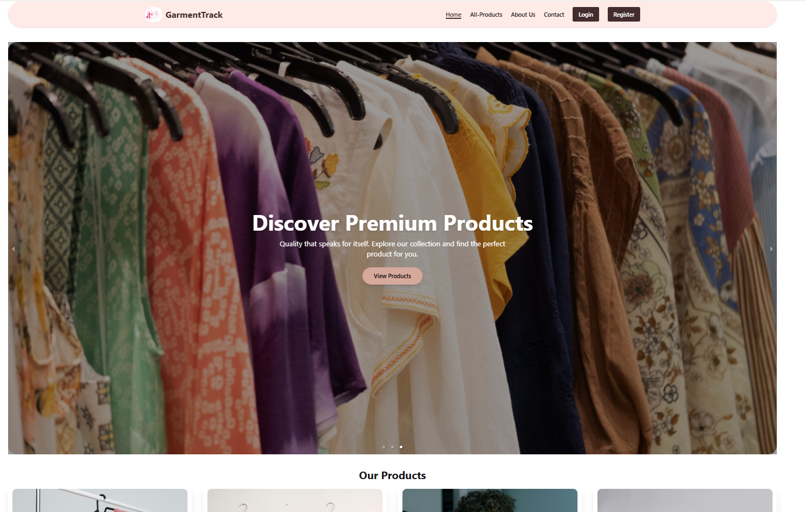

# 👔 Garments Order & Production Tracker System - GarmentTrack

<p align="center">
  
</p>


A comprehensive MERN stack platform designed for small to medium garments factories to streamline production workflows, manage inventory, and track buyer orders from cutting to delivery.

## 🚀 Live Links
- **Live Website:** https://garment-track.web.app
- **Client Repository:** https://github.com/mehers-bonna/garment-track-client.git

---

## 📖 Project Overview
The **Garments Order & Production Tracker System** is a role-based management system. It bridge the gap between Buyers, Managers, and Admins. Buyers can place orders and track production in real-time, Managers handle the production stages and product listings, while Admins oversee the entire system, including user roles and global products.

### 👤 Role-Based Features
- **Buyer:** Browse products, place orders (Stripe/COD), track production timeline (Cutting to Shipping), and manage personal dashboard.
- **Manager:** Add/Manage products, handle pending orders, and update real-time production tracking steps.
- **Admin:** Full control over user roles (Approve/Suspend), manage all products, and toggle product visibility on the home page.

---

## ✨ Key Features
- **Secure Authentication:** Firebase Email/Password & Google Login with automated role assignment.
- **Role-Based Dashboards:** Unique, protected dashboard layouts for Buyers, Managers, and Admins.
- **Dynamic Production Tracking:** Real-time timeline view for orders (Cutting -> Sewing -> Finishing -> QC -> Shipped).
- **Payment Integration:** Secure online payments using **Stripe API** for order bookings.
- **Advanced Product Management:** Managers can upload multiple images, set Minimum Order Quantities (MOQ), and add demo videos.
- **Interactive UI:** Smooth animations using **Framer Motion** and a modern, responsive design.
- **Secure Data:** Environment variables for Firebase and MongoDB credentials to ensure security.

---

## 🛠️ Technologies Used

### **Frontend:**


### **Backend & Database:**


---

## 📦 Main Dependencies
- `react-hook-form` - For efficient form handling.
- `framer-motion` - For smooth landing page animations.
- `sweetalert2` / `react-hot-toast` - For professional user notifications.
- `axios` - For secure API requests.
- `stripe/stripe-js` - For processing secure payments.

---

## 💻 Installation & Local Setup

Follow these steps to run the project locally:

1. **Clone the repository:**
   ```bash
   git clone https://github.com/mehers-bonna/garment-track-client.git
   
2. cd garment-track-client

3. npm install

4. Set up Environment Variables: Create a .env.local file in the root and add your Firebase config

VITE_apiKey=your_api_key
VITE_authDomain=your_auth_domain
VITE_projectId=your_project_id
VITE_storageBucket=your_storage_bucket
VITE_messagingSenderId=your_messaging_sender_id
VITE_appId=your_app_id

5.npm run dev
